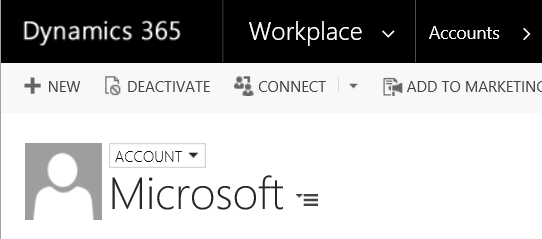
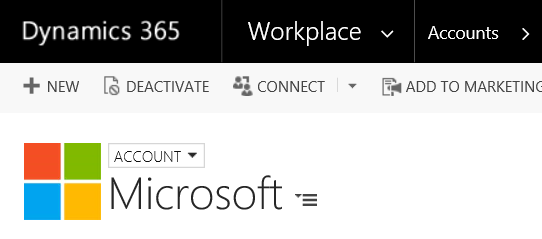

# Website Logo Activity

Since Microsoft Dynamics CRM 2013 there's been the option to add images to records to make them more easily recognizable.
However, very few people seem to bother completing them. How many people do you know that would take the time out of their
day to find the right image, resize it to the correct proportions, then upload it to CRM? It can be hard enough to get people
to put the right basic data in without worrying about such trivial things as company logos.

However, having an appropriate image on an account can make it much more instantly recognizable, so we put together a custom
workflow activity to pull a logo from the website.

## Installing

[Download the solution](WebsiteLogo_1_0_0_0_target_CRM_8.0_managed.zip) and import it into your CRM instance. The solution
includes a workflow that will populate the images for accounts based on the `Website` field, but there is also a custom workflow
activity you can use in your own workflows for other entity types or fields.

## Notes

It can take a few seconds to get an image from a website, and the process may fail entirely if the website is down or the image
is missing. For this reason the workflow to get the image will run in the background, so you will not see the image as soon as 
you save a record, but it should appear a few seconds later.

If an unexpected error occurs while trying to retrieve the logo from the website, you will see a failed system job. In the
`Details` section of the system job form will be some debugging information that would be helpful in improving the solution
further.